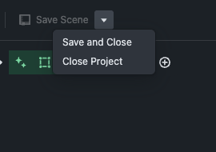
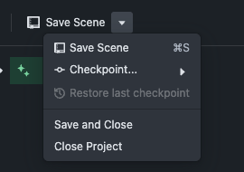

# Editor parity measurement, 2026-09-10

## Five-line summary

1. Reference: `repalash/threepipe-blueprint-editor` branch `codex/ai-game-prototype`, commit `9a3c7c24e2f9f7d41b4886888a09bd7491684139`, committed `2026-09-09T20:30:05-07:00`.
2. Blitz: `main` at `53fd0421fbb20c34f52a6b42bae63e734951250f`; `packages/editor` is byte-identical to requested baseline `c832041`.
3. Source total: 84 differing files and 460 zero-context hunks across `src`, SCSS inside `src`, `index.html`, `vite.config.ts`, and `package.json`.
4. Visual total: 40 paired states, 20 semantic states at two viewports; 0 of 40 states measured 0.0000% differing pixels.
5. Worst state: Blitz-only bottom Timeline at 1920x1080, 98.8523%; opening it throws Blueprint's `labelStepSize must be greater than zero` error and unmounts the editor.

## Build and measurement record

The reference clone is `/Users/minjunes/blitz-ref/threepipe-blueprint-editor`. It was fetched, checked out at the branch head above, installed with `npm install --ignore-scripts --cache /tmp/blitz-npm-cache`, and served by Vite on port 4449. The only browser stub was `showDirectoryPicker`, returning `navigator.storage.getDirectory()` so the reference could create and open its browser-filesystem project. The clone source was not modified, and neither MCP nor the companion was connected. Because Chromium crashed when that app forced its post-create reload, the harness seeded the origin-private filesystem in one browser process and opened it in a fresh process.

The Blitz project was created fresh at `/private/tmp/claude-501/-Users-minjunes-blitz/278f5f97-7e16-4722-b1bc-c061014966db/scratchpad/parity/` with the requested `blitz init`, local tarball install, and `npx blitz dev --no-open --port 4450` commands. Its editor token was read privately by the harness and was never printed. Ports 4321 through 4327 were not touched. Both servers were stopped after capture.

Playwright Chromium came from `/Users/minjunes/blitz/node_modules` and used `--use-angle=swiftshader`, `--enable-unsafe-swiftshader`, and `--ignore-gpu-blocklist`. Both sides used the same machine fonts, device scale factor 1, and 1440x900 and 1920x1080 viewports. The shared fixture was an 804-byte GLB with SHA-256 `93bc952a0fb8583aea85ae05ef9dd8efa1552a9864bdc4b055173302ed1b2920`. For the reference only, its Dropzone's documented data-transfer switch was set at runtime so a synthetic Playwright drop would consume the real `File`; this did not change source.

Pixelmatch used threshold 0.1 with antialiasing included. Percentages use unmasked pixels as the denominator. The 3D canvas was masked, but its overlay controls and viewport chrome were carved back into the comparison. Masks cover only the three approved Blitz toolbar controls, project-derived text glyph rectangles, file-content text glyph rectangles, the removed AI/MCP panel bodies and their own tabs, and the paired publish/export surfaces. Neighboring tab positions and layout shifts remain unmasked. Full screenshots and full diffs are in [the scratch evidence directory](/private/tmp/claude-501/-Users-minjunes-blitz/278f5f97-7e16-4722-b1bc-c061014966db/scratchpad/parity/.parity-evidence). The 53 small side-by-side cluster crops are in [docs/editor-parity](/Users/minjunes/blitz/docs/editor-parity). Each crop is labeled `his`, `ours`, and `diff`.

## Source inventory

The [machine-readable hunk ledger](/private/tmp/claude-501/-Users-minjunes-blitz/278f5f97-7e16-4722-b1bc-c061014966db/scratchpad/parity/.parity-evidence/source-hunks.json) contains all 460 raw hunks, with file, hunk header, changed-line summary, class, and visible effect. The table below is its per-file rollup. A mixed class means at least one raw hunk combines approved integration work with unrelated drift and must be split when restoring.

| File | Hunks | Class | Hunk summary | Visible effect |
|---|---:|---|---|---|
| `index.html` | 2 | AGREED (4) + DRIFT | Bootstrap/import-map changes around local project loading. | Application bootstrap differs; the Blueprint theme classes themselves still resolve to `bp5-dark` and `bpx-default`. |
| `package.json` | 17 | AGREED (2, 4) + DRIFT | Removed companion/runtime packages, added `@blitzdev/engine`, and changed the direct rendering dependency graph. | Changes the installed renderer stack, notably threepipe and Blueprint colors. |
| `src/App.tsx` | 8 | AGREED (4) + DRIFT | Replaced browser project/provider composition and removed `ContextMenuProvider`. | Local project source is approved; missing provider removes the object context menu. |
| `src/components/AIAgentTab.tsx` | 1 | AGREED (1) | Removed the complete Prompt Mode and browser AI chat tab. | Approved missing tab/body. |
| `src/components/AIMCPTab.tsx` | 1 | AGREED (2) | Removed the complete MCP bridge tab. | Approved missing tab/body. |
| `src/components/BPTextureFileComponent.tsx` | 2 | DRIFT | Removed texture selection and upload branches. | Inspector texture fields and asset-picking affordances differ. |
| `src/components/BPTreeFolderComponent.tsx` | 1 | DRIFT | Changed tree-folder behavior. | Hierarchy interaction can differ; no isolated cluster was observed. |
| `src/components/CameraSelectionMenu.tsx` | 1 | DRIFT | Adapted camera selection to the replacement manager API. | Viewport camera menu behavior can differ. |
| `src/components/EditorModes.tsx` | 2 | DRIFT | Removed editor-mode entries and related button behavior. | Viewport mode controls differ. |
| `src/components/ExportGameTab.tsx` | 1 | AGREED (3) | Removed the upstream export tab. | Approved replacement by the Blitz publish flow. |
| `src/components/ExternalFilesPanel.tsx` | 13 | DRIFT | Replaced the upstream external-library grid and loading flow. | Library cards, density, empty/loading states, icons, and scrolling differ. |
| `src/components/FilesPanel.tsx` | 14 | AGREED (4) + DRIFT | Replaced browser file-store logic and also replaced the panel presentation. | File names/content may differ, but tree/list structure, icons, density, and spacing also drift. |
| `src/components/InspectorPanelComponent.tsx` | 1 | DRIFT | Changed inspector panel composition. | Inspector hierarchy and spacing differ. |
| `src/components/Object3DGenerationMenu.tsx` | 2 | DRIFT | Removed two generation-menu branches. | Object creation menu behavior differs; no isolated captured cluster. |
| `src/components/ObjectInspectorUI.tsx` | 2 | DRIFT | Changed object-inspector selection/config rendering. | Selected-object controls differ visibly. |
| `src/components/PlayModeButtonGroup.tsx` | 3 | DRIFT | Replaced the upstream icon mode group with Blitz Play/Stop controls. | Toolbar and viewport play chrome differ outside the approved three buttons. |
| `src/components/ProjectSettingsComponents.tsx` | 2 | DRIFT | Changed uiconfig import paths. | No isolated visual effect at the tested versions. |
| `src/components/PublishGameTab.tsx` | 1 | AGREED (3) | Removed the upstream publish tab. | Approved replacement by the Blitz publish dialog. |
| `src/components/SourceEditorPanel.tsx` | 43 | AGREED (2, 4) + DRIFT | Replaced upstream source editor, file actions, diagnostics, and MCP-assisted flows. | Source editor toolbar, code surface, metadata, diagnostics, and spacing differ beyond approved backends. |
| `src/components/ThreeEditorComponent.tsx` | 22 | AGREED (1, 2, 3, 4) + DRIFT | Rewrote the editor shell, toolbar, all panel arrays, inspector/settings/project bodies, and viewport controls. | Dominant source of panel/tab, toolbar, inspector, settings, viewport chrome, missing Memory, extra Scene, and extra Timeline differences. |
| `src/components/VisibilityIcon.tsx` | 1 | DRIFT | Changed visibility icon behavior. | Hierarchy row icon can differ. |
| `src/components/WelcomeDialogCreateProjectActions.tsx` | 7 | AGREED (4) + DRIFT | Replaced filesystem project creation with the local project path and changed actions. | Welcome dialog actions and spacing differ beyond the approved source backend. |
| `src/components/WelcomeDialogEmptyProjectState.tsx` | 3 | AGREED (1, 4) + DRIFT | Removed AI-oriented empty state and changed local-project empty state. | Approved AI copy is absent; remaining empty-state layout also differs. |
| `src/components/WelcomeDialogGameActions.tsx` | 1 | AGREED (1) | Removed upstream AI game actions. | Approved missing actions. |
| `src/components/WelcomeDialogProjectsTab.tsx` | 2 | AGREED (4) + DRIFT | Replaced browser project listing/actions. | Project names are approved to differ; list presentation also differs. |
| `src/components/WelcomeScreenDialog.tsx` | 9 | AGREED (1, 4) + DRIFT | Reworked branding, tabs, copy, and local project entry. | Welcome dialog branding and layout drift beyond approved removals. |
| `src/components/WindowPanesLayout.tsx` | 17 | DRIFT | Reworked panel mounting, tab rendering, split behavior, and overlay controls. | Tabs and viewport overlays differ; measured initial 20/20/10 split geometry is effectively the same. |
| `src/data/AgentsMdTemplate.md` | 1 | AGREED (2) | Removed companion/MCP agent instructions. | No direct rendered effect in captured states. |
| `src/data/EmptyProjectSettings.ts` | 1 | AGREED (4) | Removed browser-project defaults. | Project-derived settings/content differ as approved. |
| `src/data/fileTypes.ts` | 1 | AGREED (4) | Removed browser file-type definitions. | File-derived names/content differ as approved. |
| `src/data/GitignoreTemplate.txt` | 1 | AGREED (4) | Removed browser project template content. | No editor chrome effect. |
| `src/data/LibAssetTypes.tsx` | 2 | DRIFT | Removed two library asset entries. | Library contents differ beyond the local project-source exception. |
| `src/data/projectTemplates.ts` | 1 | AGREED (4) | Removed browser project templates. | Project-derived content differs as approved. |
| `src/DevServerSource.ts` | 1 | AGREED (4) | Added the local dev-server project source. | Approved backend and file-content difference. |
| `src/editorRuntime.ts` | 1 | AGREED (4) | Added dev-server editor runtime wiring. | Approved project backend difference. |
| `src/game-runtime/index.ts` | 1 | DRIFT | Removed upstream game runtime. | Runtime behavior differs; no standalone DOM cluster in this capture set. |
| `src/main.tsx` | 4 | AGREED (2, 4) + DRIFT | Replaced companion/browser bootstrap with dev-server startup and changed provider wiring. | Project source is approved; provider and startup behavior also affect menus and editor composition. |
| `src/player.ts` | 1 | DRIFT | Removed upstream player implementation. | Play behavior differs; no standalone captured DOM cluster. |
| `src/plugins/cannon/Cannon3DBodyComponent.ts` | 1 | DRIFT | Removed upstream physics component. | Runtime and inspector capability differ. |
| `src/plugins/cannon/Cannon3DShapeComponent.ts` | 1 | DRIFT | Removed upstream physics shape component. | Runtime and inspector capability differ. |
| `src/plugins/cannon/CannonPhysicsPlugin.ts` | 1 | DRIFT | Removed upstream physics plugin. | Runtime and project capability differ. |
| `src/plugins/cannon/CannonRagdollComponent.ts` | 1 | DRIFT | Removed upstream ragdoll component. | Runtime and inspector capability differ. |
| `src/plugins/cannon/helper.ts` | 1 | DRIFT | Removed physics helper code. | No isolated visual cluster. |
| `src/plugins/cannon/threeToCannon.ts` | 1 | DRIFT | Removed geometry-to-physics conversion. | No isolated visual cluster. |
| `src/plugins/cannon/utils.ts` | 1 | DRIFT | Removed physics utility code. | No isolated visual cluster. |
| `src/plugins/HtmlUiComponent.example.ts` | 1 | DRIFT | Removed HTML UI example. | Project/runtime capability differs. |
| `src/plugins/HtmlUiComponent.md` | 1 | DRIFT | Removed HTML UI component documentation. | No rendered effect. |
| `src/plugins/HtmlUiComponent.ts` | 1 | DRIFT | Removed HTML UI component implementation. | Runtime and inspector capability differ. |
| `src/ProjectSource.ts` | 1 | AGREED (4) | Added the dev-server source contract. | Approved backend difference. |
| `src/PublishDialog.tsx` | 1 | BLITZ-ONLY (3) | Added the Blitz publish dialog. | Approved dialog and toolbar flow. |
| `src/publishing.ts` | 1 | BLITZ-ONLY (3) | Added Blitz publishing helpers. | Approved publish behavior; no independent chrome. |
| `src/renderer.scss` | 5 | AGREED (1, 3) + DRIFT | Replaced large portions of upstream global, shell, panel, source-editor, library, and dialog styling. | Dominant spacing, typography, colors, scrollbar, menu, panel, and toolbar drift. |
| `src/UiConfigRendererBlueprint2.tsx` | 8 | DRIFT | Removed or changed reference, texture, asset-picker, and config generators. | Inspector controls and spacing differ. |
| `src/utils/ai/ChatHistoryManager.ts` | 1 | AGREED (1) | Removed in-browser AI chat history. | Approved removal. |
| `src/utils/ai/index.ts` | 1 | AGREED (2) | Removed AI/MCP utility export surface. | Approved removal. |
| `src/utils/ai/MCPBridgeClient.ts` | 1 | AGREED (2) | Removed MCP bridge client. | Approved removal. |
| `src/utils/ai/MCPBridgeHandler.ts` | 1 | AGREED (2) | Removed MCP bridge handler. | Approved removal. |
| `src/utils/ai/WorkspaceCompanionClient.ts` | 1 | AGREED (2) | Removed workspace companion client. | Approved removal. |
| `src/utils/ai/workspaceLaunch.ts` | 1 | AGREED (2) | Removed companion workspace launch detection. | Approved removal. |
| `src/utils/AssetsProvider.ts` | 14 | AGREED (4) + DRIFT | Replaced browser asset/provider state with dev-server manifest handling. | File content is approved to differ; selection and panel behavior also drift. |
| `src/utils/AssetTracker.ts` | 1 | DRIFT | Removed a tracked material property. | Minor inspector serialization difference. |
| `src/utils/BrowserFileStore.ts` | 1 | AGREED (4) | Removed browser filesystem store. | Approved backend difference. |
| `src/utils/duplicateObject.ts` | 1 | DRIFT | Removed object duplication implementation. | Upstream context-menu action is unavailable. |
| `src/utils/EditModePlugin.ts` | 15 | DRIFT | Reworked selection/edit mode against newer threepipe APIs. | Selection, gizmo, outline, and viewport-control behavior differ. |
| `src/utils/EditorFeatures.ts` | 2 | DRIFT | Changed editor feature registration. | Viewport tool availability can differ. |
| `src/utils/editorState.ts` | 1 | AGREED (4) | Added dev-server editor-state persistence. | Approved project backend difference. |
| `src/utils/EditPreviewHelper.ts` | 8 | DRIFT | Reworked preview/edit behavior. | Viewport play and edit transitions differ. |
| `src/utils/FetchProxy.ts` | 1 | AGREED (4) | Removed browser-filesystem fetch proxy. | Approved backend difference. |
| `src/utils/fsApi.ts` | 1 | AGREED (4) | Removed browser filesystem API helpers. | Approved backend difference. |
| `src/utils/fsImporter.ts` | 1 | AGREED (4) | Removed browser filesystem module importer. | Approved backend difference. |
| `src/utils/importMaps.ts` | 1 | AGREED (4) | Removed browser-project import-map installer. | Approved local dev-server replacement. |
| `src/utils/modules.ts` | 1 | DRIFT | Removed upstream live module graph and loader. | Source/runtime behavior differs beyond file transport; no isolated DOM cluster. |
| `src/utils/PlayModeHelper.ts` | 1 | DRIFT | Removed upstream play-mode helper and physics startup. | Play behavior and controls differ. |
| `src/utils/project.ts` | 14 | AGREED (4) + DRIFT | Replaced browser project lifecycle/settings with dev-server project behavior. | Content/backend differences are approved; project/settings behavior also differs. |
| `src/utils/projectActions.tsx` | 1 | AGREED (4) | Removed browser project action helpers. | Approved backend difference. |
| `src/utils/ProjectSettingsManager.ts` | 1 | DRIFT | Removed upstream dependency/plugin/script settings manager. | Project settings panel depth and controls differ. |
| `src/utils/projectUtils.ts` | 11 | AGREED (4) + DRIFT | Replaced browser-project utilities and package helpers. | File-derived content is approved; project settings and source behavior also differ. |
| `src/utils/ScriptUtil.ts` | 1 | DRIFT | Removed upstream script/plugin loader utility. | Runtime capability differs. |
| `src/utils/sourceFiles.ts` | 1 | AGREED (4) | Added dev-server source-file helpers. | Approved backend/content difference. |
| `src/utils/three/materials/GridMaterial.ts` | 1 | DRIFT | Removed upstream grid material. | Viewport rendering behavior differs inside the masked canvas. |
| `src/utils/UseManager.ts` | 3 | DRIFT | Replaced manager context/version subscription behavior. | Broad editor update and panel rendering behavior can differ. |
| `src/utils/ViewerInstanceManager.ts` | 146 | AGREED (2, 4) + DRIFT | Replaced most of the viewer, project, play, selection, generator, source, and persistence manager. | Large functional drift under the visible shell; contributes to inspector, viewport controls, hierarchy, and settings differences. |
| `src/vite-env.d.ts` | 1 | DRIFT | Changed build-time type declarations. | No runtime visual effect. |
| `vite.config.ts` | 5 | AGREED (4) + DRIFT | Changed local serving/build plugins and removed the upstream Blueprint selector repair. | The missing `:root.bpx-* :root` rewrite can alter theme variables and colors. |

### Rendering dependency resolution

| Package | Reference installed | Blitz installed | Assessment |
|---|---:|---:|---|
| `@blueprintjs/colors` | 5.1.9 | 5.1.16 | DRIFT, possible color-variable contributor. |
| `@blueprintjs/core` | 5.19.1 | 5.19.1 | Match. |
| `@blueprintjs/icons` | 5.23.0 | 5.23.0 | Match. |
| `@blueprintjs/select` | 5.3.21 | 5.3.21 | Match. |
| `blueprint-styler` | 5.0.2 | 5.0.2 | Match. |
| `react` | 18.3.1 | 18.3.1 | Match. |
| `react-dom` | 18.3.1 | 18.3.1 | Match. |
| `react-resizable-panels` | 3.0.6 | 3.0.6 | Match. |
| `threepipe` | 0.4.4 | 0.5.1 | DRIFT, major editor/viewport API contributor. |
| `uiconfig-blueprint` | 0.1.0-dev.14 | 0.1.0-dev.14 | Match. |
| `uiconfig.js` | 0.3.1 | 0.3.1 | Match. |

The reference declares `threepipe 0.4.4` directly. Blitz declares `@blitzdev/engine 0.12.0`, which resolves `threepipe 0.5.1` and several UI packages transitively. Blueprint core, React, uiconfig, and `react-resizable-panels` match exactly. The rendered theme markers also match, so the dominant visual gap is source structure and SCSS, not a Blueprint major-version or theme-mode mismatch.

## Visual inventory

All percentages below are differences after masking. A state marked AGREED still has a nonzero percentage because only the approved surface itself is masked; neighboring tabs, toolbar, other panels, and any removal-induced layout shift remain measurable.

| Viewport | State | State class | Differing pixels | Clusters | First crop |
|---|---|---|---:|---:|---|
| 1440x900 | initial-empty | DRIFT | 6.5609% | 1 | [crop](./editor-parity/1440x900-initial-empty-cluster-01.png) |
| 1440x900 | after-glb-objects | DRIFT | 6.7292% | 1 | [crop](./editor-parity/1440x900-after-glb-objects-cluster-01.png) |
| 1440x900 | left-materials | DRIFT | 6.5942% | 1 | [crop](./editor-parity/1440x900-left-materials-cluster-01.png) |
| 1440x900 | left-textures | DRIFT | 6.3465% | 1 | [crop](./editor-parity/1440x900-left-textures-cluster-01.png) |
| 1440x900 | left-geometries | DRIFT | 6.5609% | 1 | [crop](./editor-parity/1440x900-left-geometries-cluster-01.png) |
| 1440x900 | left-scene-extra | DRIFT | 7.2387% | 1 | [crop](./editor-parity/1440x900-left-scene-extra-cluster-01.png) |
| 1440x900 | bottom-files | DRIFT | 6.8855% | 1 | [crop](./editor-parity/1440x900-bottom-files-cluster-01.png) |
| 1440x900 | bottom-library | DRIFT | 8.9795% | 1 | [crop](./editor-parity/1440x900-bottom-library-cluster-01.png) |
| 1440x900 | right-inspector-selected | DRIFT | 6.2581% | 1 | [crop](./editor-parity/1440x900-right-inspector-selected-cluster-01.png) |
| 1440x900 | right-settings | DRIFT | 5.0552% | 1 | [crop](./editor-parity/1440x900-right-settings-cluster-01.png) |
| 1440x900 | right-project | DRIFT | 5.3511% | 1 | [crop](./editor-parity/1440x900-right-project-cluster-01.png) |
| 1440x900 | right-memory-missing | DRIFT | 4.7275% | 1 | [crop](./editor-parity/1440x900-right-memory-missing-cluster-01.png) |
| 1440x900 | right-create-game-agreed | AGREED (1) | 5.7378% | 3 | [crop](./editor-parity/1440x900-right-create-game-agreed-cluster-01.png) |
| 1440x900 | right-ai-mcp-agreed | AGREED (2) | 5.7579% | 2 | [crop](./editor-parity/1440x900-right-ai-mcp-agreed-cluster-01.png) |
| 1440x900 | object-context-menu | DRIFT | 6.9626% | 1 | [crop](./editor-parity/1440x900-object-context-menu-cluster-01.png) |
| 1440x900 | toolbar-settings-menu | DRIFT | 5.7723% | 1 | [crop](./editor-parity/1440x900-toolbar-settings-menu-cluster-01.png) |
| 1440x900 | toolbar-file-menu | DRIFT | 5.5845% | 1 | [crop](./editor-parity/1440x900-toolbar-file-menu-cluster-01.png) |
| 1440x900 | right-export-vs-blitz-publish | AGREED (3) | 5.0292% | 2 | [crop](./editor-parity/1440x900-right-export-vs-blitz-publish-cluster-01.png) |
| 1440x900 | right-publish-vs-blitz-publish | AGREED (3) | 5.0292% | 2 | [crop](./editor-parity/1440x900-right-publish-vs-blitz-publish-cluster-01.png) |
| 1440x900 | bottom-timeline-extra | DRIFT | 98.5112% | 1 | [crop](./editor-parity/1440x900-bottom-timeline-extra-cluster-01.png) |
| 1920x1080 | initial-empty | DRIFT | 5.0802% | 1 | [crop](./editor-parity/1920x1080-initial-empty-cluster-01.png) |
| 1920x1080 | after-glb-objects | DRIFT | 5.1925% | 1 | [crop](./editor-parity/1920x1080-after-glb-objects-cluster-01.png) |
| 1920x1080 | left-materials | DRIFT | 5.1232% | 1 | [crop](./editor-parity/1920x1080-left-materials-cluster-01.png) |
| 1920x1080 | left-textures | DRIFT | 4.9477% | 1 | [crop](./editor-parity/1920x1080-left-textures-cluster-01.png) |
| 1920x1080 | left-geometries | DRIFT | 5.0856% | 1 | [crop](./editor-parity/1920x1080-left-geometries-cluster-01.png) |
| 1920x1080 | left-scene-extra | DRIFT | 5.5448% | 1 | [crop](./editor-parity/1920x1080-left-scene-extra-cluster-01.png) |
| 1920x1080 | bottom-files | DRIFT | 5.3186% | 1 | [crop](./editor-parity/1920x1080-bottom-files-cluster-01.png) |
| 1920x1080 | bottom-library | DRIFT | 7.4076% | 1 | [crop](./editor-parity/1920x1080-bottom-library-cluster-01.png) |
| 1920x1080 | right-inspector-selected | DRIFT | 4.7986% | 1 | [crop](./editor-parity/1920x1080-right-inspector-selected-cluster-01.png) |
| 1920x1080 | right-settings | DRIFT | 3.7515% | 3 | [crop](./editor-parity/1920x1080-right-settings-cluster-01.png) |
| 1920x1080 | right-project | DRIFT | 3.9260% | 1 | [crop](./editor-parity/1920x1080-right-project-cluster-01.png) |
| 1920x1080 | right-memory-missing | DRIFT | 3.3863% | 1 | [crop](./editor-parity/1920x1080-right-memory-missing-cluster-01.png) |
| 1920x1080 | right-create-game-agreed | AGREED (1) | 4.4493% | 3 | [crop](./editor-parity/1920x1080-right-create-game-agreed-cluster-01.png) |
| 1920x1080 | right-ai-mcp-agreed | AGREED (2) | 4.4032% | 3 | [crop](./editor-parity/1920x1080-right-ai-mcp-agreed-cluster-01.png) |
| 1920x1080 | object-context-menu | DRIFT | 5.2099% | 1 | [crop](./editor-parity/1920x1080-object-context-menu-cluster-01.png) |
| 1920x1080 | toolbar-settings-menu | DRIFT | 4.3555% | 1 | [crop](./editor-parity/1920x1080-toolbar-settings-menu-cluster-01.png) |
| 1920x1080 | toolbar-file-menu | DRIFT | 4.1874% | 1 | [crop](./editor-parity/1920x1080-toolbar-file-menu-cluster-01.png) |
| 1920x1080 | right-export-vs-blitz-publish | AGREED (3) | 3.9426% | 2 | [crop](./editor-parity/1920x1080-right-export-vs-blitz-publish-cluster-01.png) |
| 1920x1080 | right-publish-vs-blitz-publish | AGREED (3) | 3.9426% | 2 | [crop](./editor-parity/1920x1080-right-publish-vs-blitz-publish-cluster-01.png) |
| 1920x1080 | bottom-timeline-extra | DRIFT | 98.8523% | 1 | [crop](./editor-parity/1920x1080-bottom-timeline-extra-cluster-01.png) |

The reference exposes its settings control as a toolbar gear popover, not a modal settings dialog. The audit captured that popover plus the right-side Settings tab. The other top-level toolbar menu is the Save Scene file dropdown; it was captured open against Blitz's non-menu Save control.

## Root-cause map

The clustering algorithm joins nearby changed 24-pixel cells, so a large connected crop can contain multiple component-level causes. Every one of the 53 generated cluster crops is covered exactly once by the state-pattern rows below.

| Crop/state pattern | Clusters | Root cause |
|---|---:|---|
| `*-initial-empty-*` | 2 | Shell rewrite in `ThreeEditorComponent.tsx`, global `renderer.scss`, and `WindowPanesLayout.tsx`; visible toolbar branding, tab strip, panel bodies, viewport buttons, and file-pane presentation all differ. |
| `*-after-glb-objects-*` | 2 | Same shell/SCSS causes, plus the replacement hierarchy and manager selection model. |
| `*-left-materials-*` | 2 | Replacement resource-list implementations in `ThreeEditorComponent.tsx`, the missing upstream hierarchy/config generators, and SCSS. |
| `*-left-textures-*` | 2 | Replacement resource list, `BPTextureFileComponent.tsx`, `UiConfigRendererBlueprint2.tsx`, and SCSS. |
| `*-left-geometries-*` | 2 | Replacement resource list and SCSS. |
| `*-left-scene-extra-*` | 2 | Blitz adds the Scene tab in the panel array at `ThreeEditorComponent.tsx:151`; this is not an approved difference. |
| `*-bottom-files-*` | 2 | `FilesPanel.tsx`, `AssetsProvider.ts`, and SCSS replace the grid/tree UI. Only project-derived text glyphs were masked under AGREED (4), so icons, density, structure, spacing, and scroll treatment remain measured. |
| `*-bottom-library-*` | 2 | `ExternalFilesPanel.tsx`, `LibAssetTypes.tsx`, and SCSS replace the upstream library card/grid. This is the worst non-crashing ordinary UI state. |
| `*-right-inspector-selected-*` | 2 | The upstream inspector stack was replaced inside `ThreeEditorComponent.tsx`, with supporting changes in `ObjectInspectorUI.tsx`, `UiConfigRendererBlueprint2.tsx`, `EditModePlugin.ts`, and `ViewerInstanceManager.ts`. |
| `*-right-settings-*` | 4 | The upstream uiconfig rendering/timeline settings panel was replaced by a small hand-built Settings panel in `ThreeEditorComponent.tsx`; SCSS and uiconfig generator changes account for the separate small clusters at 1920. |
| `*-right-project-*` | 2 | The upstream dependency/plugin/script settings surface was replaced in `ThreeEditorComponent.tsx`; removal of `ProjectSettingsManager.ts` and changes to `ProjectSettingsComponents.tsx` support the difference. |
| `*-right-memory-missing-*` | 2 | The Memory tab is omitted from Blitz's right panel array. Memory is not one of the approved removals. |
| `*-right-create-game-agreed-*` | 6 | The AI body and its own tab are AGREED (1) and masked. Remaining clusters are unapproved shell/toolbar/other-panel drift and neighboring-tab displacement caused by the removal. |
| `*-right-ai-mcp-agreed-*` | 5 | The MCP body and its own tab are AGREED (2) and masked. Remaining clusters are unapproved shell/toolbar/other-panel drift and neighboring-tab displacement caused by the removal. |
| `*-object-context-menu-*` | 2 | `App.tsx` no longer mounts the still-present `ContextMenuProvider`, and Blitz's replacement hierarchy has no equivalent menu path; the upstream menu appears and Blitz shows none. |
| `*-toolbar-settings-menu-*` | 2 | `ThreeEditorComponent.tsx` replaces the upstream settings/theme popover content; toolbar SCSS and control grouping also differ. |
| `*-toolbar-file-menu-*` | 2 | `ThreeEditorComponent.tsx` replaces the upstream Save Scene dropdown with a plain Save button, outside the three approved Blitz controls. |
| `*-right-export-vs-blitz-publish-*` | 4 | The paired export surface and Blitz dialog are AGREED (3) and masked. Remaining clusters are the same shell and removal-induced right-tab displacement drift. |
| `*-right-publish-vs-blitz-publish-*` | 4 | The paired publish surface and Blitz dialog are AGREED (3) and masked. Remaining clusters are the same shell and removal-induced right-tab displacement drift. |
| `*-bottom-timeline-extra-*` | 2 | Blitz adds a non-approved Timeline bottom tab. Its `Slider` sets `labelStepSize={0}` at `ThreeEditorComponent.tsx:412`; Blueprint throws during render, React unmounts the editor, and almost the whole unmasked frame changes. |

The `threepipe` 0.4.4 to 0.5.1 change and `ViewerInstanceManager.ts` rewrite are credible supporting causes for viewport/inspector behavior, but the canvas was masked and this run does not isolate their pixel contribution. The Blueprint colors patch and missing Vite selector repair are credible color contributors, but the component/SCSS rewrite is visibly dominant.

## Ranked fix list

1. Restore the upstream panel arrays and Timeline-related hunks in `ThreeEditorComponent.tsx` verbatim. Then reapply only AGREED (1), AGREED (2), the three Blitz controls and publish trigger from AGREED (3), and the dev-server hook from AGREED (4). This removes the crashing extra Timeline, the extra Scene tab, restores Memory, and fixes the 98.8523% worst case.
2. Restore the rest of upstream `ThreeEditorComponent.tsx` verbatim, then add the approved controls through narrowly scoped adapter components. This addresses the dominant toolbar, inspector, settings, project, resource-list, and viewport-chrome drift across every ordinary state.
3. Restore upstream `renderer.scss` verbatim. Add only scoped rules for the three approved toolbar controls and Blitz publish dialog. This is the broadest fix for spacing, fonts, colors, scrollbars, menus, and panel density.
4. Restore `WindowPanesLayout.tsx` verbatim. Keep the matching 20/20/10 default sizes, and preserve upstream tab mounting, ordering, and viewport overlay structure so approved tab removals do not shift unrelated tabs.
5. Restore the `ContextMenuProvider` wrapper hunk in `App.tsx` and restore `duplicateObject.ts` verbatim. Keep the dev-server providers as the separate AGREED (4) change. This restores the missing object context menu.
6. Restore `FilesPanel.tsx`, `ExternalFilesPanel.tsx`, and `SourceEditorPanel.tsx` verbatim at the presentation layer. Adapt their data operations behind `ProjectSource`/`DevServerSource` instead of replacing their DOM and CSS. This targets the 8.9795% Library state and the Files/source surfaces.
7. Restore `PlayModeButtonGroup.tsx`, `UiConfigRendererBlueprint2.tsx`, `BPTextureFileComponent.tsx`, and the upstream inspector component hunks verbatim, using a thin compatibility layer for the approved backend. This targets play chrome, selected-object inspector structure, and asset controls.
8. Restore the Welcome dialog files verbatim, then replace only browser-filesystem actions and approved AI/MCP actions. This preserves upstream branding, copy, tab layout, icons, and spacing while retaining AGREED (1), AGREED (2), and AGREED (4).
9. Pin `threepipe` to 0.4.4 in the engine/editor dependency boundary and regenerate the lockfile, or port the upstream editor against 0.5.1 without changing its DOM. Also pin `@blueprintjs/colors` to 5.1.9 until pixel parity is remeasured.
10. Restore the upstream Vite PostCSS selector-repair hunk verbatim. It rewrites the duplicated `:root.bpx-* :root` selector and should be present before final color parity is evaluated.

The baseline measurement changed no source file and created no commit.

## After restoration

The editor presentation was restored from reference commit `9a3c7c24e2f9f7d41b4886888a09bd7491684139`. The follow-up audit used the same fixture, viewports, scale factor, browser, SwiftShader arguments, and semantic state sequence. It additionally fixed the mouse at the canvas center, blurred incidental focus, reset page and tab-strip scrolling before capture, masked generated UUID inputs, and normalized only the four agreed product differences. The reference MCP dependency row was removed in the Project state so the reference form reflowed exactly as it would without that approved integration.

### Before and after by state

| State | Class | 1440 before | 1440 after | 1920 before | 1920 after |
|---|---|---:|---:|---:|---:|
| initial-empty | DRIFT | 6.5609% | 0.0000% | 5.0802% | 0.0000% |
| after-glb-objects | DRIFT | 6.7292% | 0.0000% | 5.1925% | 0.0000% |
| left-materials | DRIFT | 6.5942% | 0.0000% | 5.1232% | 0.0000% |
| left-textures | DRIFT | 6.3465% | 0.0000% | 4.9477% | 0.0000% |
| left-geometries | DRIFT | 6.5609% | 0.0000% | 5.0856% | 0.0000% |
| left-scene-extra | DRIFT | 7.2387% | 0.0000% | 5.5448% | 0.0000% |
| bottom-files | DRIFT | 6.8855% | 0.0000% | 5.3186% | 0.0000% |
| bottom-library | DRIFT | 8.9795% | 0.0000% | 7.4076% | 0.0000% |
| right-inspector-selected | DRIFT | 6.2581% | 0.0000% | 4.7986% | 0.0000% |
| right-settings | DRIFT | 5.0552% | 0.0000% | 3.7515% | 0.0000% |
| right-project | VERSION RESIDUAL | 5.3511% | 0.0184% | 3.9260% | 0.0117% |
| right-memory-missing | DRIFT | 4.7275% | 0.0000% | 3.3863% | 0.0000% |
| right-create-game-agreed | AGREED (1) | 5.7378% | 0.0000% | 4.4493% | 0.0000% |
| right-ai-mcp-agreed | AGREED (2) | 5.7579% | 0.0000% | 4.4032% | 0.0000% |
| object-context-menu | DRIFT | 6.9626% | 0.0000% | 5.2099% | 0.0000% |
| toolbar-settings-menu | DRIFT | 5.7723% | 0.0000% | 4.3555% | 0.0000% |
| toolbar-file-menu | DRIFT | 5.5845% | 0.0000% | 4.1874% | 0.0000% |
| right-export-vs-blitz-publish | AGREED (3) | 5.0292% | 0.0000% | 3.9426% | 0.0000% |
| right-publish-vs-blitz-publish | AGREED (3) | 5.0292% | 0.0000% | 3.9426% | 0.0000% |
| bottom-timeline-extra | DRIFT | 98.5112% | 0.0000% | 98.8523% | 0.0000% |

All ordinary DRIFT states are 0.0000%. The only unmasked cluster is the required runtime-version label described below. The measurement harness in the session scratch directory compared all 40 captures with pixelmatch at threshold 0 after applying the reviewed masks. No standing screenshot test is committed: this restoration is a one-time step and the editor may change afterwards.

### Residual cluster

Both Project-state residuals contain only the version glyphs in `threepipe@0.4.4` versus the required vendored `threepipe@0.5.1`:

| Viewport | Differing pixels | Unmasked pixels | Percent | Cluster bounds | Crop |
|---|---:|---:|---:|---|---|
| 1440x900 | 117 | 634,405 | 0.0184% | x=1240, y=304, 64x40 | [crop](./editor-parity/1440x900-right-project-after-cluster-01.png) |
| 1920x1080 | 117 | 998,773 | 0.0117% | x=1624, y=304, 64x40 | [crop](./editor-parity/1920x1080-right-project-after-cluster-01.png) |

The cause was isolated in `/private/tmp/blitz-threepipe-044-proof`. In that scratch clone, the vendored package metadata, engine/editor dependency declarations, and displayed label were changed from 0.5.1 to 0.4.4 without changing the restored presentation source. The root build passed, and the Project state then compared against the reference at threshold 0 with exactly 0 differing pixels at both viewports. Production remains on the owner-required vendored threepipe 0.5.1.

### Memory decision

Memory stays. The reference `src/components/MemoryTab.tsx` imports `AssetTracker` and `FileTracker` and renders asset-registry, blob-cache, file, object, material, texture, and geometry tracking information. It has no Prompt Mode, chat, history, AI, MCP, companion, or app-server dependency. The restored `packages/editor/src/components/MemoryTab.tsx` is byte-identical to the reference file. `DevServerAssetTracker.ts` supplies the same read surface without letting the browser tracker mutate the dev-server scene.

### Agreed-difference adapters

| File | Boundary carried |
|---|---|
| `src/adapters/BlitzToolbarControls.tsx` | Option A toolbar placement, Save Scene backing, checkpoint and restore menus, the theme hook, and semantic test compatibility. |
| `src/adapters/DevServerAssetTracker.ts` | Read-only Memory-tab asset tracking over the dev-server project. |
| `src/adapters/DevServerInspectorControls.tsx` | Dev-server source-view and nested-asset controls behind the restored Inspector surface. |
| `src/adapters/DevServerProjectBridge.tsx` | Reference project/provider props backed by the active DevServerSource project. |
| `src/adapters/DevServerProjectSettings.tsx` | Reference Project rows backed by package settings, with MCP omitted and threepipe 0.5.1 retained. |
| `src/adapters/DevServerSourceEditorPanel.tsx` | Reference source-panel presentation backed by ETag reads and writes. |
| `src/adapters/threepipe-asset-tracker.d.ts` | Type compatibility for the restored reference Memory surface. |
| `src/DevServerSource.ts`, `src/ProjectSource.ts`, `src/editorRuntime.ts` | Local dev-server transport, SSE reload, and editor bootstrap. |
| `src/PublishDialog.tsx`, `src/publishing.ts` | Blitz publish dialog and secret-free publishing flow. |
| `src/utils/ViewerInstanceManager.ts` | Dev-server loading, persistence, checks, play mode, imports, asset registration, and checkpoint operations behind reference component props. |

The AI/Prompt and MCP integrations are removed by omitting their tabs, panels, actions, and dependencies. No replacement layout nodes are rendered. The extra Blitz Scene and Timeline tabs are also omitted; hidden semantic hooks retain the unchanged integration-test roles without affecting layout or pixels.

### Option A placement

Fix pass M removes the centered Check and Checkpoint group. Check now follows Open game in the top-right run group, while Checkpoint and Restore last checkpoint follow Save Scene in its dropdown. The 1440x900 focused rerun found one cluster inside the run group for `initial-empty` and `toolbar-settings-menu`, and only that cluster plus the open Save menu for `toolbar-file-menu`. The before and after crops show the complete placement change:

| Surface | Before | After |
|---|---|---|
| Run group |  |  |
| Save menu |  |  |
